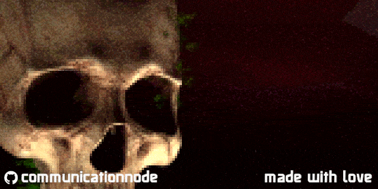
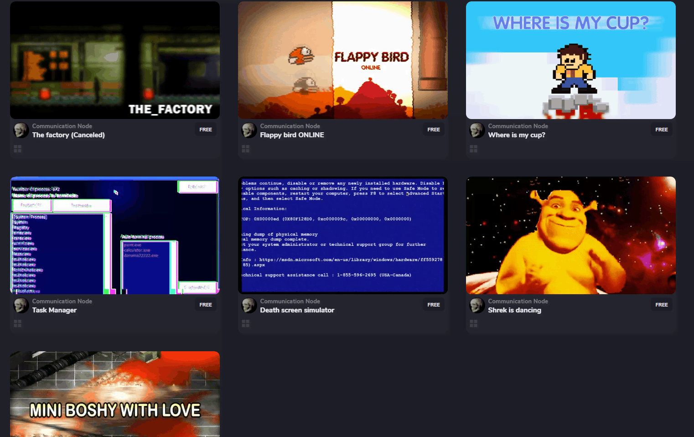
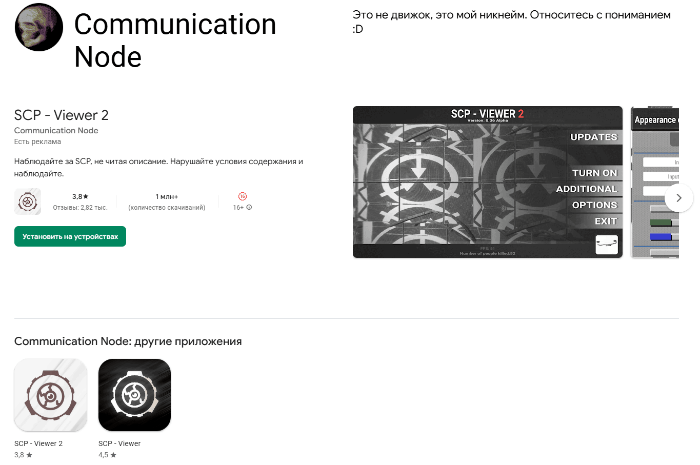
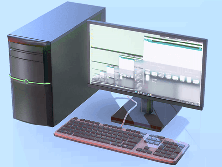
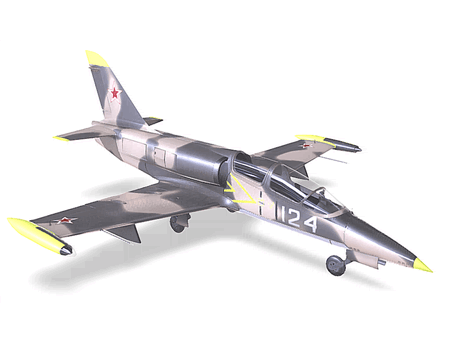
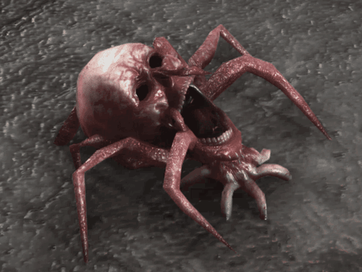
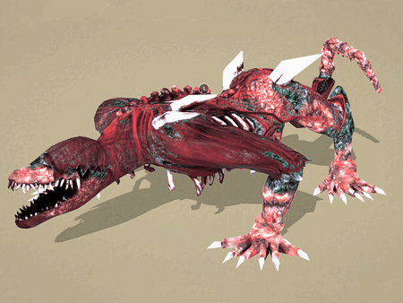

------

#### 	Hello!

I'm 23 years old and work in application development. My interests revolve around game design, so I enjoy 3D design, programming, and sharing my work.

####  My default stack:

------

####  Platforms I work with:

  

------

<!--  -->

####  My published projects.

preview:

|     [GameJolt](https://gamejolt.com/@CommunicationNode)      | [Play Market](https://play.google.com/store/apps/dev?id=4806053180322862173) |
| :----------------------------------------------------------: | :----------------------------------------------------------: |
|  |  |

####  My 3D models.

preview:

| [Personal computer](https://sketchfab.com/3d-models/personal-computer-aa398650fe6e4baa8771c71266d842f4) | [L-39 Aero Vodochody](https://sketchfab.com/3d-models/l-39-aero-vodochody-3c23373c170741e78626634c5fc438f4) | [Crying head 2](https://sketchfab.com/3d-models/crying-head-2-2867ed3cd41243caaf9dd24eeccf6ca5) | [SCP-682 Low-Poly](https://sketchfab.com/3d-models/scp-682-low-poly-style-e40059dbf3334081a1577602b8d98335) |
| :----------------------------------------------------------: | :----------------------------------------------------------: | :----------------------------------------------------------: | :----------------------------------------------------------: |
|  |  |  |  |

####  My contacts.

:mailbox_with_mail: My email: <a href="starven38@bk.ru"> starven38@bk.ru </a> :mailbox_with_mail:

