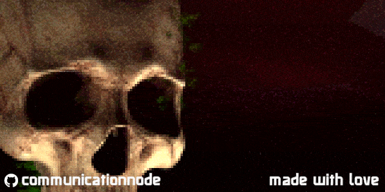

My email: <a href="ComNode@mail.ru"> ComNode@mail.ru </a>

 

------

# Hello, User!

My main focus is developing computer and mobile games. 

I also develop technical software for Windows and Unix environments, including Arduino, ESP32, and other platforms.

# About

#### (Languages) - that i use:

    

------

#### (Tools & IDE) - that i use:

       

------

#### (My products OS) - that i use:

  

------

