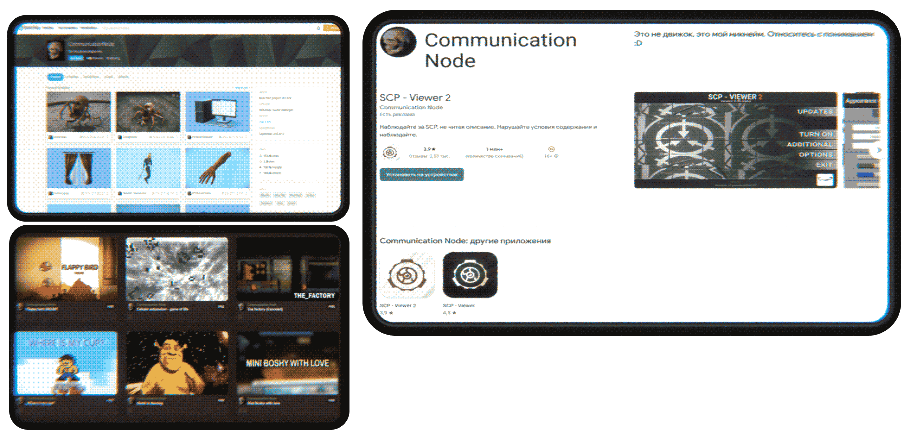

<!---▒▒▒▒▒▒▒▒▒▒▒▒▒▒▒▒▒▒▒▒▒▒▒▒▒▒▒▒▒▒▒▒▒▒▒▒▒▒▒▒▒▒▒ comment line ▒▒▒▒▒▒▒▒▒▒▒▒▒▒▒▒▒▒▒▒▒▒▒▒▒▒▒▒▒▒▒▒▒▒▒▒▒▒▒▒▒▒▒▒▒▒▒▒▒▒▒▒▒▒▒▒▒▒▒▒▒▒▒▒▒▒▒▒▒▒▒▒▒▒▒▒▒▒▒▒▒▒▒▒▒▒▒▒▒▒▒▒▒▒▒▒▒▒▒▒▒▒▒▒▒▒▒▒▒▒▒▒▒▒▒▒▒▒▒▒▒▒▒▒--->

# Hello there!
💀 My name is not matter as usual and I'm a Indie game developer. I have more than 5 years of experience in program solutions like a Unity, Unreal Engine, Blender, Adobe solutions, and etc.  
💀 I prefer to use C# as main language, JavaScript as additional (Jint and same), sometimes i use C and C++ for Arduino solutions.  
💀 I like to grow my professional skills.  
💀 At last i work with ArchiViz projects, VR and MR simulator complex systems.  
> [!NOTE]
> The best of my sources i publish here

<!--  -->

# My projects preview.
<ul align="left">

<li>My <a href="https://gamejolt.com/@CommunicationNode">GameJolt</a>. The idk it shit games i've created in past is here;  
<li>My <a href="https://play.google.com/store/apps/dev?id=4806053180322862173">Play Market</a>. The best of my commercial indie projects is here;  
<li>My <a href="https://sketchfab.com/Starven38/models">SketchFab</a>. The original 3D models that ready for games solutions here;  

</ul> 

 

# My contacts.

:mailbox_with_mail: My email: <a href="starven38@bk.ru"> starven38@bk.ru </a> :mailbox_with_mail:

